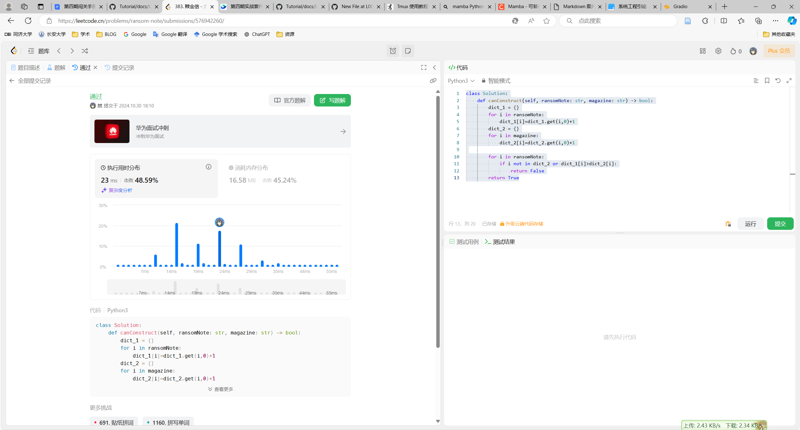

# 任务一
## Python 代码
```python
class Solution:
    def canConstruct(self, ransomNote: str, magazine: str) -> bool:
        dict_1 = {}
        for i in ransomNote:
            dict_1[i]=dict_1.get(i,0)+1
        dict_2 = {}
        for i in magazine:
            dict_2[i]=dict_2.get(i,0)+1

        for i in ransomNote:
            if i not in dict_2 or dict_1[i]>dict_2[i]:
                return False
        return True

```
## 通关截图

# 任务二
## Bug
debug
![bug][Img/2000-任务二-bug图.png]
主要原因大模型没有正确处理json格式的输出
1. 存在```符号的干扰
2. 存在非数字类的文本但是没有用""字符串的格式表示
![成功][Img/2000-任务二-运行截图.png]

## 代码:
```python
from openai import OpenAI
import json
from config import api_key

def internlm_gen(prompt, client):
    '''
    LLM生成函数
    Param prompt: prompt string
    Param client: OpenAI client 
    '''
    response = client.chat.completions.create(
        model="internlm2.5-latest",
        messages=[
            {"role": "user", "content": prompt},
        ],
        stream=False
    )
    return response.choices[0].message.content

client = OpenAI(
    base_url="https://internlm-chat.intern-ai.org.cn/puyu/api/v1/",
    api_key=api_key)

content = """
书生浦语InternLM2.5是上海人工智能实验室于2024年7月推出的新一代大语言模型，提供1.8B、7B和20B三种参数版本，以适应不同需求。
该模型在复杂场景下的推理能力得到全面增强，支持1M超长上下文，能自主进行互联网搜索并整合信息。
"""
prompt = f"""
请帮我从以下``内的这段模型介绍文字中提取关于该模型的信息，要求包含模型名字（字符串）、开发机构（字符串）、提供参数版本（列表）、上下文长度（字符串）四个内容，以json格式返回。参数涉及到B或者M之类的的请用字符串表示
`{content}`
"""
res = internlm_gen(prompt, client)
res = res.lstrip('````json').rstrip('````')
print(res)
res_json = json.loads(res)
print(res_json)
```
