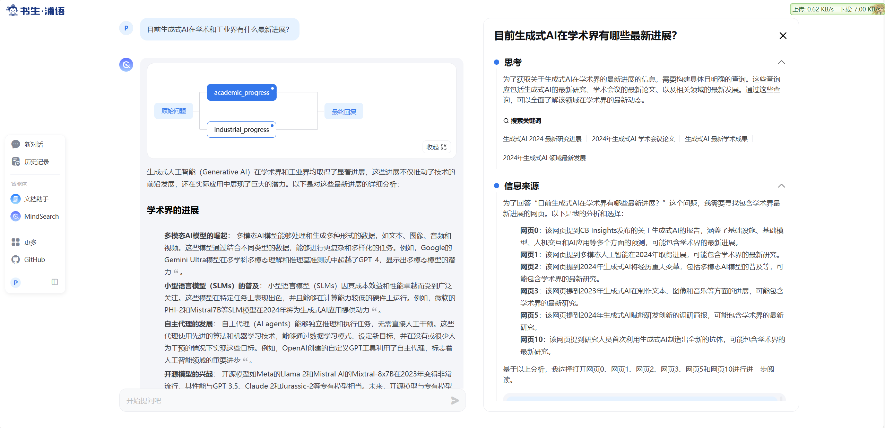
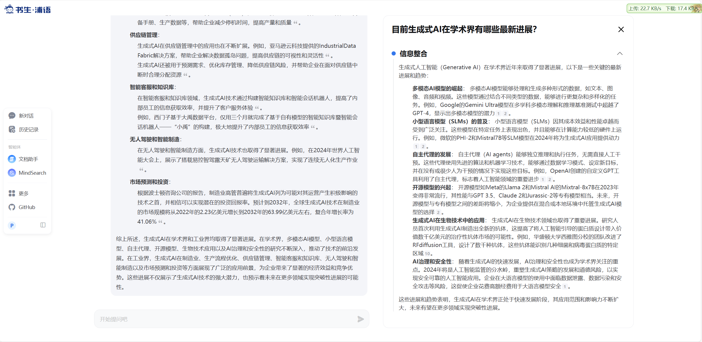
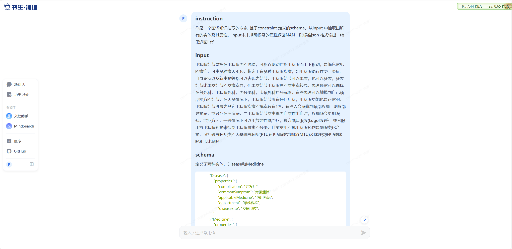
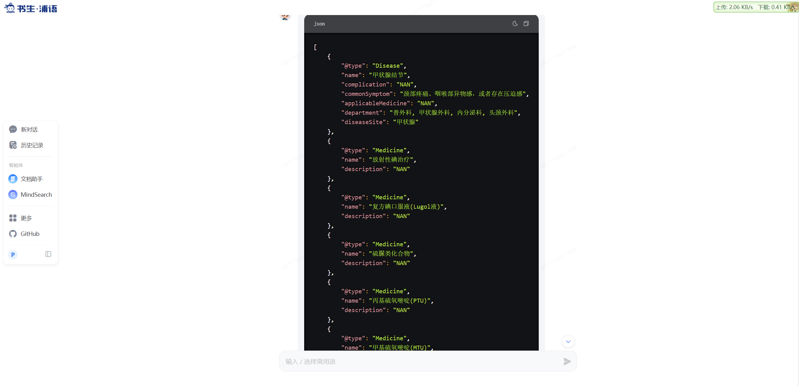
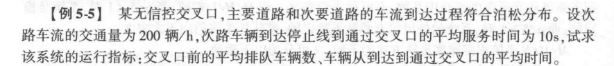
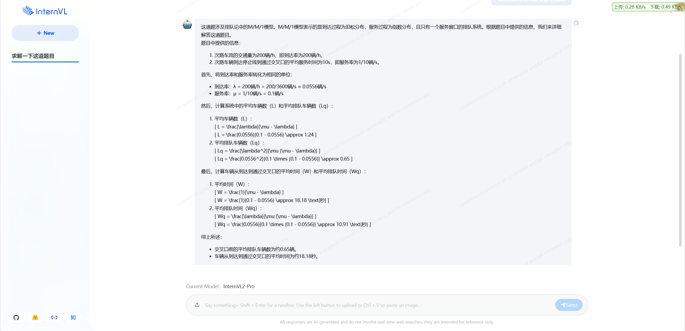

# 任务一
## MindSearch

提问为：“目前生成式AI在学术和工业有什么最新进展”

回答为：
```markdown
生成式人工智能（Generative AI）在学术界和工业界均取得了显著进展，这些进展不仅推动了技术的前沿发展，还在实际应用中展现了巨大的潜力。以下是对这些最新进展的详细分析：

## 学术界的进展
多模态AI模型的崛起： 多模态AI模型能够处理和生成多种形式的数据，如文本、图像、音频和视频。这些模型通过结合不同类型的数据，能够进行更复杂和多样化的任务。例如，Google的Gemini Ultra模型在多学科多模态理解和推理基准测试中超越了GPT-4，显示出多模态模型的潜力。

小型语言模型（SLMs）的普及： 小型语言模型（SLMs）因其成本效益和性能卓越而受到广泛关注。这些模型在特定任务上表现出色，并且能够在计算能力较低的硬件上运行。例如，微软的PHI-2和Mistral7B等SLM模型在2024年将为生成式AI应用提供动力。

自主代理的发展： 自主代理（AI agents）能够独立推理和执行任务，无需直接人工干预。这些代理使用先进的算法和机器学习技术，能够通过数据学习模式、设定新目标，并在没有或很少人为干预的情况下实现这些目标。例如，OpenAI创建的自定义GPT工具利用了自主代理，标志着人工智能领域的重要进步。

开源模型的兴起： 开源模型如Meta的Llama 2和Mistral AI的Mixtral-8x7B在2023年变得非常流行，其性能与GPT 3.5、Claude 2和Jurassic-2等专有模型相当。未来，开源模型与专有模型之间的差距将缩小，为企业提供在混合或本地环境中托管生成式AI模型的选择。

生成式AI在生物技术中的应用： 生成式AI在生物技术领域也取得了重要进展。研究人员首次利用生成式AI制造出全新的抗体，这提高了将人工智能引导的蛋白质设计带入价值数千亿美元的治疗性抗体市场的可能性。例如，华盛顿大学西雅图分校的团队改进了RFdiffusion工具，设计了数千种抗体，这些抗体能识别几种细菌和病毒蛋白质的特定区域。

AI治理和安全性： 随着生成式AI的快速发展，AI治理和安全性也成为学术界关注的重点。2024年将是人工智能监管的分水岭，重塑生成式AI策略的发展和道德风险，以实现安全可靠的人工智能应用。企业在大语言模型的使用中面临数据泄露、数据污染和安全攻击等风险，这促使企业花费高额经费用于大语言模型安全。

## 工业界的进展
### 制造业的广泛应用：
2024年，制造业企业开始更广泛地采用生成式AI技术，将其作为数字化工具箱的核心组成部分及质量管理的关键推动者。Gartner的研究预测，到2026年，超过80%的企业将采用生成式AI模型，或者将其部署在生产过程中。
在产品研发设计方面，生成式AI技术通过增强高性能计算，提供创新设计，帮助企业更快、更有效地探索各种设计选项，从而降低成本、减少材料消耗、缩短工程设计时间。
### 生产流程优化：
生成式AI在优化生产流程方面也显示出巨大潜力。例如，博世在希尔德斯海姆的生产线上，利用生成式AI的仿真绘制技术，合成出超过15000张关于产品缺陷的图像，提升了电机定子的质量检验效率，并将项目工期缩短了六个月。
生成式AI还被用于优化整体设备效率（OEE），通过分析历史机器维护数据、维修数据、设备手册、生产数据等，帮助企业减少停机时间，提高产量和质量。
### 供应链管理：
生成式AI在供应链管理中的应用也在不断扩展。例如，亚马逊云科技提供的IndustrialData Fabric解决方案，帮助企业解决数据孤岛问题，提高供应链的可视性和灵活性。
生成式AI还被用于预测需求、优化库存管理、降低供应链风险，并帮助企业在面对供应链中断时合理分配资源。
### 智能客服和知识库：
在智能客服和知识库领域，生成式AI技术通过构建智能知识库和智能会话机器人，提高了内部员工的信息获取效率，并提升了客户服务体验。
例如，西门子基于大禹数据平台，仅用三个月就完成了基于自有模型的智能知识库暨智能会话机器人——“小禹”的构建，极大地提升了内部员工的信息获取效率。
### 无人驾驶和智能制造：
在无人驾驶和智能制造方面，生成式AI技术也取得了显著进展。例如，在2024年世界人工智能大会上，展示了搭载易控智驾露天矿无人驾驶运输解决方案，实现了连续无人化生产作业。
### 市场预测和投资：
根据波士顿咨询公司的报告，制造业高管普遍将生成式AI列为可能对其运营产生积极影响的技术之首，并相信可以实现潜在的投资回报率。预计到2032年，全球生成式AI技术在制造业的市场规模将从2022年的2.23亿美元增长到2032年的63.99亿美元左右，复合年增长率为41.06%。

综上所述，生成式AI在学术界和工业界均取得了显著进展。在学术界，多模态AI模型、小型语言模型、自主代理、开源模型、生物技术应用以及AI治理和安全性的研究不断深入，推动了技术的前沿发展。在工业界，生成式AI在制造业、生产流程优化、供应链管理、智能客服和知识库、无人驾驶和智能制造以及市场预测和投资等方面展现了广泛的应用前景，为企业带来了显著的经济效益和竞争优势。这些进展不仅展示了生成式AI技术的强大潜力，也预示着未来在更多领域实现突破性进展的可能性。
```



## 书生·浦语

场景：使用大模型进行知识图谱的构建
提问为：
```markdown
# instruction
你是一个图谱知识抽取的专家, 基于constraint 定义的schema，从input 中抽取出所有的实体及其属性，input中未明确提及的属性返回NAN，以标准json 格式输出，结果返回list"
# input 
甲状腺结节是指在甲状腺内的肿块，可随吞咽动作随甲状腺而上下移动，是临床常见的病症，可由多种病因引起。临床上有多种甲状腺疾病，如甲状腺退行性变、炎症、自身免疫以及新生物等都可以表现为结节。甲状腺结节可以单发，也可以多发，多发结节比单发结节的发病率高，但单发结节甲状腺癌的发生率较高。患者通常可以选择在普外科，甲状腺外科，内分泌科，头颈外科挂号就诊。有些患者可以触摸到自己颈部前方的结节。在大多情况下，甲状腺结节没有任何症状，甲状腺功能也是正常的。甲状腺结节进展为其它甲状腺疾病的概率只有1%。有些人会感觉到颈部疼痛、咽喉部异物感，或者存在压迫感。当甲状腺结节发生囊内自发性出血时，疼痛感会更加强烈。治疗方面，一般情况下可以用放射性碘治疗，复方碘口服液(Lugol液)等，或者服用抗甲状腺药物来抑制甲状腺激素的分泌。目前常用的抗甲状腺药物是硫脲类化合物，包括硫氧嘧啶类的丙基硫氧嘧啶(PTU)和甲基硫氧嘧啶(MTU)及咪唑类的甲硫咪唑和卡比马唑
# schema
定义了两种实体，Disease和Medicine

"Disease": {
    "properties": {
        "complication": "并发症",
        "commonSymptom": "常见症状",
        "applicableMedicine": "适用药品",
        "department": "就诊科室",
        "diseaseSite": "发病部位",
    }
},
"Medicine": {
    "properties": {
    }
}
```
抽取结果：
```json
[
    {
        "@type": "Disease",
        "name": "甲状腺结节",
        "complication": "NAN",
        "commonSymptom": "颈部疼痛、咽喉部异物感，或者存在压迫感",
        "applicableMedicine": "NAN",
        "department": "普外科, 甲状腺外科, 内分泌科, 头颈外科",
        "diseaseSite": "甲状腺"
    },
    {
        "@type": "Medicine",
        "name": "放射性碘治疗",
        "description": "NAN"
    },
    {
        "@type": "Medicine",
        "name": "复方碘口服液(Lugol液)",
        "description": "NAN"
    },
    {
        "@type": "Medicine",
        "name": "硫脲类化合物",
        "description": "NAN"
    },
    {
        "@type": "Medicine",
        "name": "丙基硫氧嘧啶(PTU)",
        "description": "NAN"
    },
    {
        "@type": "Medicine",
        "name": "甲基硫氧嘧啶(MTU)",
        "description": "NAN"
    },
    {
        "@type": "Medicine",
        "name": "甲硫咪唑",
        "description": "NAN"
    },
    {
        "@type": "Medicine",
        "name": "卡比马唑",
        "description": "NAN"
    }
]
```




## 书生·万象

提问为："求解一下这道题目"

题目为：

回答为:
