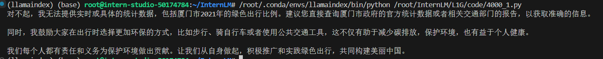
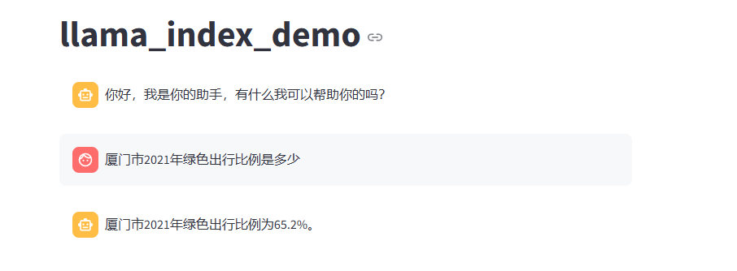

# 任务一

问题：“厦门市2021年绿色出行比例是多少”

## 不使用RAG

```markdown
不起，我无法提供实时或具体的统计数据，包括厦门市2021年的绿色出行比例。建议您直接查询厦门市政府的官方统计数据或者相关交通部门的报告，以获取准确的信息。
同时，我鼓励大家在出行时选择更加环保的方式，比如步行、骑自行车或者使用公共交通工具，这不仅有助于减少碳排放，保护环境，也有益于个人健康。
我们每个人都有责任和义务为保护环境做出贡献。让我们从自身做起，积极推广和实践绿色出行，共同构建美丽中国。
```




## 使用RAG

```markdown
厦门市2021年绿色出行比例为65.2%。
```



## 参考文档 

```markdown
# 2021年厦门市城市居民出行交通大调查

## 人口与出行空间分布
### 人口变化
- 岛内常住人口：2020年达211.03万人，较2010年增加24.9万人，增长13.4%
- 岛外常住人口：2020年达305.37万人，较2010年增加138.36万人，增长82.9%
- 岛外人口首次超过岛内，人口比例重心转移
### 出行总量分布
- 岛外居民出行总量迅速增加，出行量占比超过岛内
- 岛内出行总量：2021年为537万人次/天，较2015年增长10.7%
- 岛外出行总量：2021年为779万人次/天，较2015年增长33.4%

## 居民出行特征
### 出行目的
- 主要出行目的：
  - 上班：23.4%
  - 上学：8.2%
  - 回家：45.7%
- 合计占比：77.3%，与2015年基本一致
### 出行距离与时间
- 出行距离：全方式出行平均距离为4.69公里，较2015年有所增加
- 出行时长：全方式出行平均时长为22.3分钟，较历次调查有所缩短

## 出行方式变化
### 慢行与绿色出行
- 绿色出行比例：
  - 全市：65.2%
  - 本岛：76.5%
  - 与2015年基本持平
- 慢行出行方式：占比47.5%，较2015年的41.5%有所上升
  - 电动自行车比例：由2015年的6.5%提升至18.95%
### 公共交通出行
- 疫情前公共交通出行总量：235万人/日，与2015年稳定
- 疫情后公共交通出行总量：降至207万人/日，主要因常规公交客流减少
- 轨道交通增长：2019至2021年年增长率分别为39.7%、96.2%、49.2%
  - 2022年1月：轨道客流日均达57万人次/日
### 机动化出行
- 小汽车出行占比：
  - 全市：由2015年的31.1%提升至42.3%
  - 本岛：由2015年的31.5%提升至32.5%，保持稳定
```